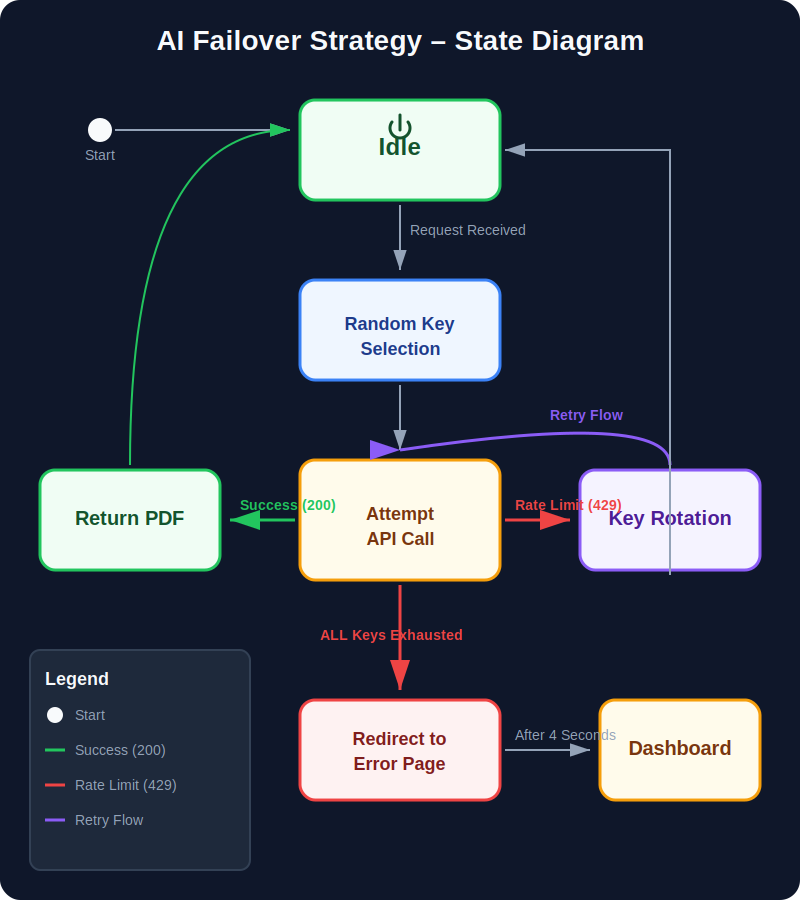

# YourHelper – AI-Powered Job Preparation & Resume Tailoring

YourHelper is a high-performance, full-stack application designed to transform how candidates prepare for interviews and optimize their resumes. By leveraging advanced AI models (Google Gemini), OCR technology, and dynamic PDF rendering, YourHelper provides a premium, automated experience for job seekers.

---

## 🚀 Key Features

- **🎯 AI Resume Tailoring**: Automatically generates ATS-friendly, high-density resumes based on a specific Job Description.
- **📊 Interview Readiness Reports**: Analyzes the gap between your profile and a job role, providing technical/behavioral questions and a 7-day preparation plan.
- **📄 Professional PDF Engine**: Uses Puppeteer to render pixel-perfect resumes that look human-written.
- **🔍 Intelligent OCR**: Extracts text from existing PDF resumes using Tesseract.js for seamless AI analysis.
- **🛡️ High Availability**: Implements a custom **AI Load Balancer** with multi-key rotation to bypass rate limits and ensure 100% uptime.
- **🔒 Secure Auth**: Integrated Google OAuth and JWT-based local authentication.

---

## 🏗️ System Architecture


The application follows a modern decoupled architecture:
- **Frontend**: React.js with Vite for blazing-fast performance.
- **Backend**: Node.js & Express managing the business logic and service orchestration.
- **Database**: MongoDB for persistent storage of user profiles and preparation history.

---

## ⚙️ How It Works (Interaction Flow)


1. **Upload/Input**: User submits their details or uploads a PDF.
2. **Processing**: Backend extracts text via OCR and sends a tailored prompt to the AI pool.
3. **AI Generation**: The Load Balancer selects an available Gemini key to generate the report/resume.
4. **Rendering**: Puppeteer converts the AI's structured HTML into a downloadable PDF.

---

## 💎 AI Reliability Strategy



We implemented a robust **Failover Strategy** to handle Gemini API rate limits (429 errors):
- **Randomized Key Selection**: Spreads load across a pool of API keys.
- **Instant Rotation**: Automatically switches keys and retries if one is busy.
- **Graceful Degradation**: If all keys are exhausted, the user sees a premium "Taking a Breather" page with a smart auto-redirect timer.

---

## 📂 Project Structure

```bash
├── Frontend/             # React + Vite application
│   ├── src/features/     # Modular feature-based structure
│   └── public/           # Static assets
├── Backend/              # Node.js + Express server
│   ├── src/services/     # AI, OCR, and PDF logic
│   ├── src/models/       # Mongoose schemas
│   └── docs/             # Technical diagrams (SVG)
└── package.json          # Root configuration
```

---

## 📊 Class Structure


---

## 🛠️ Tech Stack

- **Frontend**: React, Tailwind CSS (optional), Lucide Icons, Axios, React-Router.
- **Backend**: Node.js, Express, Puppeteer (PDF), Tesseract.js (OCR), Zod (Validation).
- **AI**: Google Generative AI (Gemini 2.0 Flash).
- **Database**: MongoDB Atlas.

---

## 📈 Roadmap & Timeline


---

## 🏁 Getting Started

1. **Clone the repo**:
   ```bash
   git clone https://github.com/your-username/YourHelper.git
   ```
2. **Install Dependencies**:
   ```bash
   cd Frontend && npm install
   cd ../Backend && npm install
   ```
3. **Environment Variables**:
   Add your `GOOGLE_GENAI_API_KEYS` (comma-separated) to `Backend/.env`.
4. **Run App**:
   ```bash
   # In separate terminals
   npm run dev (Backend)
   npm run dev (Frontend)
   ```

---

Developed with ❤️ for job seekers everywhere.
